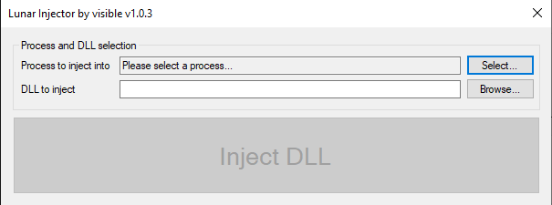
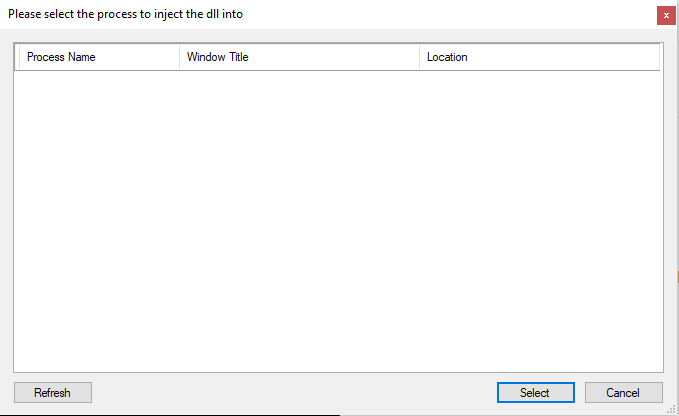

# Lunar Injector
Lunar is a safe and easy to use DLL Injector.

## Info
Lunar shows you all the available processes and **DOESN'T** gets flagged by Windows Defender. Other anti-virus might flag it, but it's 100% safe to use.

## Preview

 
Click to view images

 
 
 

## Downloads

Download it [here](https://github.com/manovisible/lunarinjector/releases). 

## Credits

### Frans Bouma 
For the [IGCS](https://github.com/FransBouma/InjectableGenericCameraSystem) Source Code (used parts of the source code and kinda copied the design).

## Additional Stuff
Frans, if you ever read this, this is **NON-PROFIT**, and I credited you properly. If there is any problem, please contact me and I will delete this repository IMMEDIATELY.
